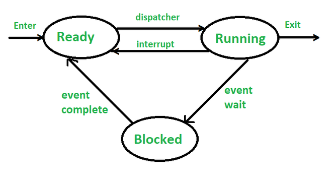
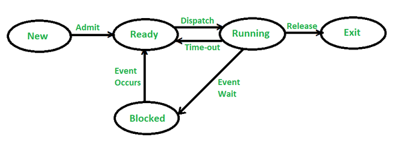
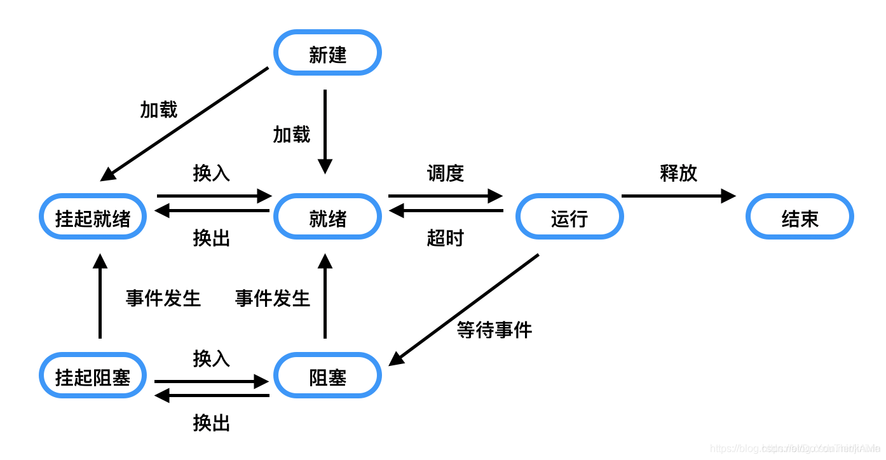

# 1.两状态进程模型
通过观察可知：一个进程要么正在执行，要么没有执行。因此可以构造最简单的模型————两状态模型：
- 运行态；
- 为运行态；
# 2.进程的创建和终止
进程的创建：
>当一个新进程被添加到那些被管理的进程中时，操作系统需要创建用于管理该进程的数据结构，并在内存中为其分配地址空间。

进程终止：
>批处理作业中应该包含一个**halt指令**或**用于终止的操作系统显示服务调用**来终止。
>
>很多种情况和错误故障都会导致进程终止。

# 3.五状态模型
## (1)三状态模型
在非运行状态下，存在着两种情况：
- 一是已经就绪等待执行的进程；
- 二是处于阻塞状态下等待I/O操作结束的进程。因此提出了三状态模型

    >（1）就绪：当一个进程获得了除处理机以外的一切所需资源，一旦得到处理机即可运行，则称此进程处于就绪状态。就绪进程可以按多个优先级来划分队列。例如，当一个进程由于时间片用完而进入就绪状态时，排入低优先级队列；当进程由I／O操作完成而进入就绪状态时，排入高优先级队列。
    >
    >（2）运行：当一个进程在处理机上运行时，则称该进程处于运行状态。处于此状态的进程的数目小于等于处理器的数目，对于单处理机系统，处于运行状态的进程只有一个。在没有其他进程可以执行时（如所有进程都在阻塞状态），通常会自动执行系统的空闲进程。
    >
    >（3）阻塞：也称为等待或睡眠状态，一个进程正在等待某一事件发生（例如请求I/O而等待I/O完成等）而暂时停止运行，这时即使把处理机分配给进程也无法运行，故称该进程处于阻塞状态。
<div align=center>

</div>

## (2)五状态模型
对于一个实际的系统，进程的状态及其转换更为复杂。引入**新建态**和**终止态**构成了进程的五态模型。

>新建态： 对应于进程刚刚被创建时没有被提交的状态，并等待系统完成创建进程的所有必要信息。 进程正在创建过程中，还不能运行。操作系统在创建状态要进行的工作包括分配和建立进程控制块表项、建立资源表格（如打开文件表）并分配资源、加载程序并建立地址空间表等。创建进程时分为两个阶段，第一个阶段为一个新进程创建必要的管理信息，第二个阶段让该进程进入就绪状态。由于有了新建态，操作系统往往可以根据系统的性能和主存容量的限制推迟新建态进程的提交。
>
>终止态：进程已结束运行，回收除进程控制块之外的其他资源，并让其他进程从进程控制块中收集有关信息（如记帐和将退出代码传递给父进程）。类似的，进程的终止也可分为两个阶段，第一个阶段等待操作系统进行善后处理，第二个阶段释放主存。

<div align=center>

</div>

# 4.被挂起的进程（七状态模型)
```
挂起（英语：suspend）是指在操作系统行程管理将前台的行程暂停并转入后台的动作。将进程挂起可以让用户在前台执行其他的行程。挂起的行程通常释放除CPU以外已经占有的系统资源，如内存等。
```
因为处理器比I/O设备的速度快很多，即使是在多道程序设计情况下，大多数时候处理器仍然处于空闲状态。
该问题的解决方案为**交换**：
>当内存中没有处于就绪状态时，**操作系统就把被阻塞的进程换出到磁盘中的“挂起队列”中**。操作系统在此之后取出挂起队列中的另一个进程，或者接受一个新的进程的请求，将其纳入到内存中运行。

因此我们提出一个“挂起”态，根据进程是否阻塞和进程是否挂起，需要四种状态：
- **就绪**：进程在内存中并可以执行；
- **阻塞**：进程在内存中并在等待一个事件；
- **阻塞/挂起态**：进程在外存中并等待一个事件；
- **就绪/挂起态**：进程在外存中，但是只需要被载入到内存中就可。

<div align=center>

</div>

---

<div align=center>

</div>

## 挂起的其他原因
1. 终端用户的请求。当终端用户在自己的程序运行期间发现有可疑问题时，希望暂停使自己的程序静止下来。亦即，使正在执行的进程暂停执行；若此时用户进程正处于就绪状态而未执行，则该进程暂不接受调度，以便用户研究其执行情况或对程序进行修改。我们把这种静止状态成为“挂起状态”。

2. 父进程的请求。有时父进程希望挂起自己的某个子进程，以便考察和修改子进程，或者协调各子进程间的活动。

3. 负荷调节的需要。当实时系统中的工作负荷较重，已可能影响到对实时任务的控制时，可由系统把一些不重要的进程挂起，以保证系统能正常运行。

4. 操作系统的需要。操作系统有时希望挂起某些进程，以便检查运行中的资源使用情况或进行记账。

5. 交换的需要。为了缓和内存紧张的情况，将内存中处于阻塞状态的进程换至外存上。


