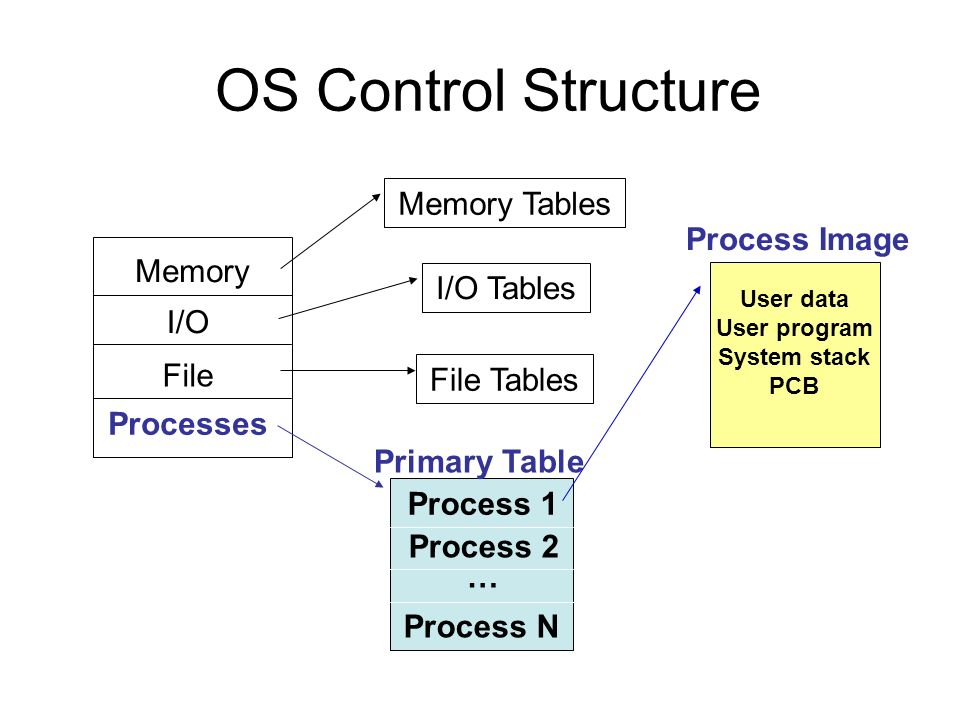

# 1.操作系统的控制结构

操作系统为了管理**进程**和**资源**，必须掌握关于每个进程和资源的当前状态信息。为此，操作系统构造并维护它所管理的每个实体的信息表。

操作系统维护着四个不同的表：
1. 内存
2. I/O
3. 文件
4. 进程

信息表 | 功能
:---------:|----------
 内存表 | 跟踪内存和外存
 I/O表 | 管理计算机设备中的I/O设备和通道
 文件表 | 提供文件是否存在、文件在外存中的位置、当前状态和其他属性等信息
 进程表 | 进程表中的每一项都至少包含一个指向进程映像的指针

>虽然这是四种不同的表，但这些表必须以某种方式链接起来交叉使用。内存、I/O、文件是代表进程而被管理的，因此进程表中必需要对这些资源的直接或间接引用。

# 2.进程控制结构
## (1) 进程位置
进程映像(process image)：**由程序、数据、栈和属性集合(进程控制块)组成。**
项目|说明
:--:|--
程序代码（或文本）|	要执行的程序指令。请注意，当程序运行时，处理器不必将整个进程读入物理内存，而是通过称为“动态分页”的过程来读取。下一个指令块根据需要加载并且可以在进程之间共享。
程序数据 | 可以区分为初始化变量，包括外部全局变量和静态变量、未初始化变量（在 Unix 衍生系统上称为 bss 区域）。默认情况下，进程之间不共享数据块。
堆	| 一个进程通常至少有两个后进先出 (LIFO) 堆栈，包括一个用于用户模式的用户堆栈和一个用于内核模式的内核堆栈。
过程控制块 | 操作系统控制进程所需的信息。

进程映像保存在邻近的连续存储块中。该存储块位于外存中。为了执行一个进程，该进程映像必须载入到内存中或者至少载入虚拟内存中。
## (2) 进程属性
进程控制块可以分为三类：
- 进程标识信息；
- 处理器状态信息；
- 进程控制信息；
  
# 3.进程控制块的作用
进程控制块包含操作系统所需要的关于进程的所有信息。
